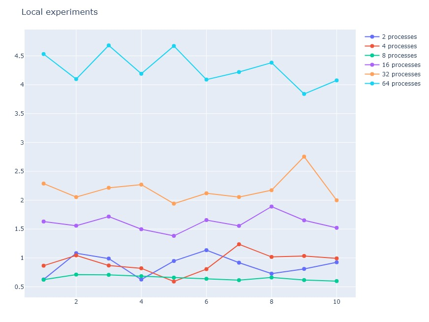

# Parallel-Distributed-Systems-part2

Suppose a dataset with a total of **N points**, constisting of **d dimensions**, that are evenly distributed accross **p processes**. This assignment's purpose is composing an _MPI algorithm_ that will be able to sort the points according to their distance from a random pivot point chosen by the **Master** (which is the name we have chosen to give to the process that is both responsible for the points it possesses and organizing the rest of the workers). This is realized by using helper functions and _distributeByMedian_, which is the main part of the algorithm. It takes a group of p processes, and provides the first _p/2 procsses_ with the points that are closer to the pivot (i.e. with distances equal or smaller than the median distance) and the rest of the points go to the remaining half.
\
\
_distributeByMedian_ was composed to function recursively, leading to each processes containing the points that are closer to the pivot than the ones of the next process and further than the ones of the previous process. Below are the main points of our team's solution to the given task.

## Extracting a dataset to work with
First and foremost, we needed a dataset that would be large enough to give us valuable insight into the algorithm, but also enable us to work with it locally, without the need to actually make the algorithm distributed (even though it is already obvious that MPI works that way and no spaces of memory are shared between processes). That dataset was selected to be **_MNIST_**.
\
As taken from the [DeepAI reference:](https://deepai.org/dataset/mnist)
The MNIST database, an extension of the NIST database, is a low-complexity data collection of handwritten digits used to train and test various supervised machine learning algorithms. The database contains 70,000 28x28-pixel black and white images representing the digits zero through nine. To obtain the points we unfolded each image into a vector of length 784.
\
\
This means we had to work with approximately 70000 points (more on the exact number of points later on) of 784 dimensions. After having done that, it was time for us to organize our algorithm.

## Distributing the points
We selected to read the maximum power of 2 total of points, to ensure compatibility and an even number of points for each process. Distributing the points was pretty straightforward.
\
\
The Master has the `mnist.bin` binary file stored in its disk space and reads the first two integers of the database: number of dimensions and number of total points and then calculates how many points will be assigned to each process using the aforementioned method. Afterwards, a total of `d * p`  points are read, where `d` is the number dimensions and `p` the number of points per process. It sends them out to the processes, ordered by their rank and keeps the first batch of floats for itself.
\
**Note:** The array of points is one dimensional. Hence, each points starts at index `i * dimensions` for `i = 0...points-1`.

## Extracting the pivot and starting to execute the algorithm
After every process has gotten its points, the Master randomly selects a pivot point from the ones it owns and broadcasts it. Then the processes calculate each of their point's distance from the pivot and send the arrays of distances back to the Master using `MPI_Gather`, whose responsibility is to find the median. That is calculated by using quickselect and taking the average of the two observations in the middle of the array, since the number of distances is even.
\
\
Afterwards, the median is broadcast, and the processes (including the Master) sort their points based on the ones they want to keep and the ones they don't: The first p/2 processes keep points that are closer to the pivot and vice versa. Based on the "side" of the group a process lies, it sorts the points array keeping the unwanted values to the right. Our team found that including the distances **equal to the median** to the unwanted points minimized the checks that needed to be made and ensured the algorithm would not stall. Excluding those points sometimes led to non-symmetric behavior, with more points needing to be swapped on one side than the other.
\
\
During the sorting procedure, the processes also keep track of the number of unwanted points of all others. These numbers are then broadcast to all processes so they can start communicating, without the need of the Master acting as the middleman.

## Executing distributeByMedian
During the first call of the function, each process finds its position in the side it is on. This means that it uses the number of points it wants to get rid of and places itself in a priority array formed in ascending order. As soon as that sort has taken place, processes at the same positions but opposite halves communicate and trade the maximum number of points they can. We call this iteration a **round**. These rounds are repeated so long as even one of the processes possesses unwanted elements. When everything is sorted, the `splitGroup` function splits the group of processes into two, each one using its own _MPI Communicator_, via the `MPI_Comm_Split` function.
\
\
Now that every process holds a new set of points, `comm_rank` and `comm_size`, it calculates the new distances and re-enters distributeByMedian, with the new group median the `findNewMedian` function provided it with. The iterations stop when the new `comm_size == 1`. We then know that every process has been assigned its final points.

## Troubleshooting during sorting
It was quite often that a process had an extra unwanted element to give away, while everybody else seemed to be sorted, thus breaking the code by entering an infinite loop. We found that this was caused by points with a distance from the pivot that was equal to the median value offsetting the assumed symmetry of unwanted elements. We solved this challenge by adding some extra checks on `distributeByMedian`.
\
\
A group of processes that reached 50 _rounds_ was given the `sorted flag`, but forced to iterate through the same repetition of the function instead of continuing with the recursion. This ensured that the unwanted point was traded with a median, but did not resolve the assymetry. Since we knew that the new extra point was a median, we simply forced the function to continue with the recursion after repeating itself once. This proved to be sufficient for solving every problem that arose while testing.

## Self-checking
Once the points are sorted, we have to perform a self check to make sure the algorithm yielded the correct result. It is easy to prove that the validity of the algorithm can be confirmed by comparing each process's maximum distance with the next process' minimum. If the maximum is smaller or equal to the next minimum, we know we managed to sort the points as required.
\
\
This was implemented by using the `MPI Window` methods, that require little to no synchronization and enables a process to peek at someone else's local chunks of memory without `MPI_Send` and `MPI_Recv`.

## Measurements - Conclusions

### Local experiments
Below are the experiments conducted locally for **2, 4, 8, 16, 32 and 64 processes**:
\
\

Right away, we can observe that time the execution time is almost linearly dependent on the number of processes. This is due to two factors:
1. More processes mean more tasks working in parallel. The parallel speedup reaches a plateau about near the point where they exceed a PC's number of _logical cores_.
2. They also mean more calculations per repetition and a greater recursion depth. 

### Experiments on a distributed system
For these experiments we used the University's HPC facilities.

